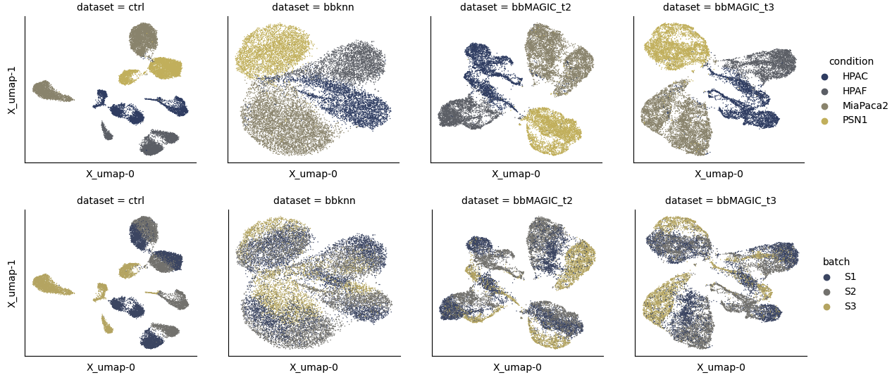

# bbMAGIC

bbMAGIC (batch balanced MAGIC) is a combination of the MAGIC imputation method with the BBKNN batch correction method.

BBKNN creates a neighborhood network and accounts for batch effects by identifying neighbors in each batch separately. This is currently used for combined visualization of different batches in a UMAP embedding.

MAGIC uses a diffusion-like process to denoise single-cell RNA seq data based on a kNN graph.

bbMAGIC connects the two: It calculates the BBKNN neighborhood graph and supplies the adjacency matrix to MAGIC data imputation in order to batch-integrate the given spatiomolecular matrix.

The following graph compares the effect of applying bbMAGIC to the data, followed by regular UMAP with applying BBKNN-integated UMAP. The left column shows the raw data without correcting for batch-effects.



## Installation

The Python package can be downloaded from this GitLab repo via pip. Just run this command in your Terminal:

```
$ pip install git@git.embl.de:mklein/bbmagic.git
```

It installs the package and all dependencies.

## Usage

There is a high-level function to perform imputation which works similar to scanpy.external.pp.magic. 

```
import bbknn_magic as bm

adata = sc.read("/path/to/your/adata.h5ad")
# data should be normalized to a fixed ion count and log-transformed
sc.pp.normalize_total(adata, target_sum=1e4)
sc.pp.log1p(adata)

adata_imputed = bm.bb_magic(
    adata, 
    batch_key = 'batch',              # column name of the batch information in adata.obs
    neighbors_within_batch = 3,       # bbknn
    n_pcs = 100,                      # bbknn
    t=2,                              # magic
    copy=True,                        # creates new adata instead of overwriting adata.X
    random_state=1                    # for reproducibility
)


```

Additionally, also numpy arrays and pandas DataFrames can be imputed. For them, the batch information has be supplied as additional array:

```
df_imputed = bm.bb_magic_array(
    adata.to_df(), 
    batch_array = adata.obs['batch'], # bbknn
    neighbors_within_batch = 3,       # bbknn
    n_pcs = 100,                      # bbknn
    t=2,                              # magic
    random_state=1                    # for reproducibility
)
```

